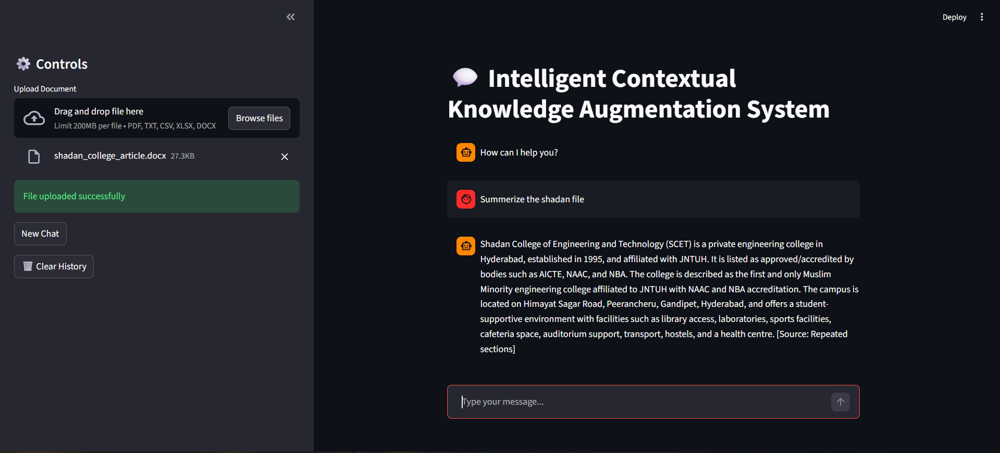

# ICKAS - Intelligent Contextual Knowledge Augmentation System

A Retrieval-Augmented Generation (RAG) based chatbot that enables users to upload documents and interact with them through intelligent question-answering. Built with FastAPI, LangChain, Qdrant, and Streamlit.

## Table of Contents

- [Features](#features)
- [Prerequisites](#prerequisites)
- [Configuration](#configuration)
- [Usage](#usage)
- [API Endpoints](#api-endpoints)
- [Screenshots](#screenshots)
- [License](#license)
- [Authors](#authors)

## Features

- **Document Upload & Processing**: Supports PDF, TXT, CSV, XLSX, and DOCX files
- **Vector Storage**: Uses Qdrant for efficient vector embeddings storage
- **Intelligent Q&A**: Leverages LangChain and Groq LLM for context-aware responses
- **Web Interface**: Streamlit-based UI for easy interaction
- **REST API**: FastAPI backend for programmatic access
- **Secure & Contextual**: Answers based solely on uploaded documents

## Prerequisites

- Python 3.10 or higher
- Qdrant vector database (local or cloud instance)
- API keys for:
  - Groq (LLM service)
  - LangSmith (tracing)
  - Hugging Face (embeddings)


## Configuration

Create a `.env` file in the root directory with the following variables:

```env
GROQ_API_KEY=your_groq_api_key
LANGSMITH_API_KEY=your_langsmith_api_key
LANGSMITH_PROJECT=your_project_name
HUGGINGFACEHUB_API_TOKEN=your_huggingface_token
```

Ensure Qdrant is running locally (default port 6333) or update the connection in `Qdrant.py` for a remote instance.

## Usage

1. **Start the FastAPI backend**:
   ```bash
   uvicorn app:app --reload --host 0.0.0.0 --port 8000
   ```

2. **Launch the Streamlit UI** (in a separate terminal):
   ```bash
   streamlit run Streamlit_UI.py
   ```

3. **Access the application**:
   - Web UI: http://localhost:8501
   - API Docs: http://localhost:8000/docs

4. **Interact**:
   - Upload documents via the sidebar
   - Ask questions in the chat interface
   - Get context-aware answers from your documents

## API Endpoints

- `POST /Upload`: Upload and process a document
- `POST /Query`: Ask questions based on uploaded documents
- `POST /chat`: General chat with the LLM
- `GET /health`: Health check


## Screenshots
### Sample Q&A Output



## License

This project is licensed under the MIT License - see the [LICENSE](LICENSE) file for details.

## Authors

- **Mallepalli Mahesh** - [GitHub Profile](https://github.com/mallepallymahesh47-ui?tab=repositories)

*Project developed at Shadan College of Engineering and Technology under the guidance of Sridhar Sir (HOD of Technology)*
